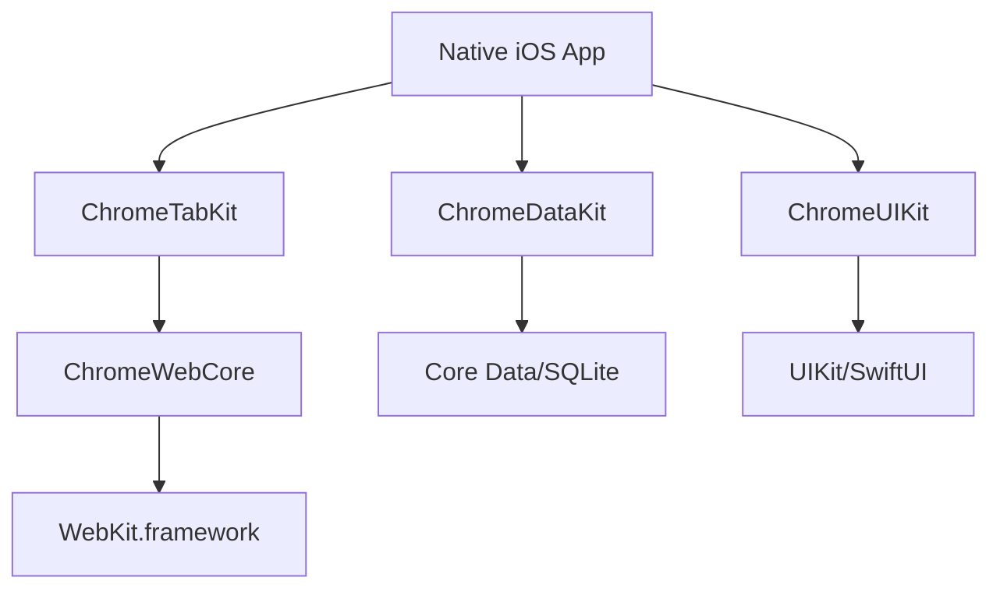
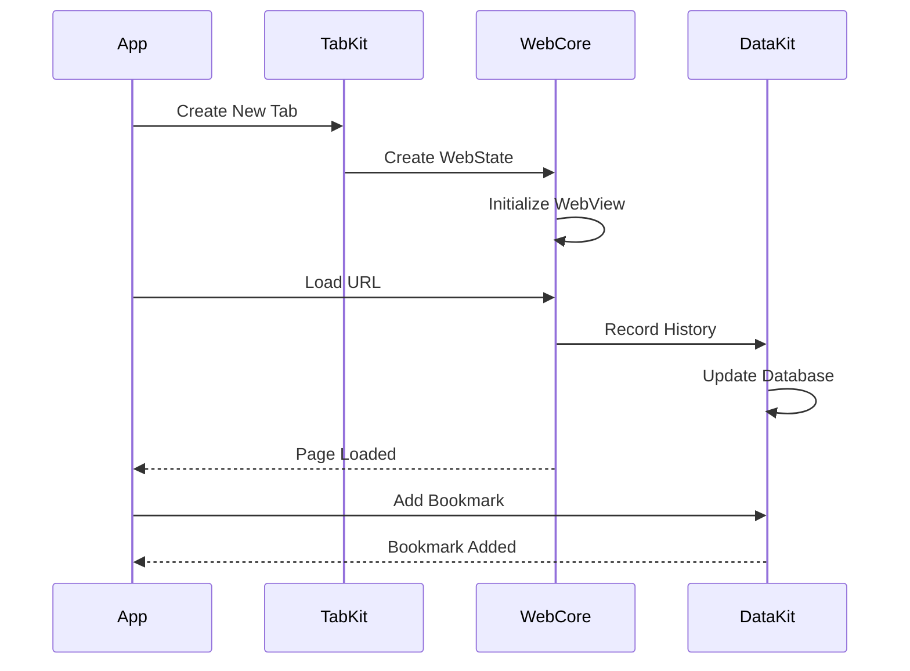
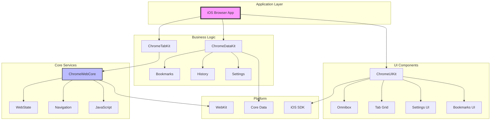

# iOS Chrome Monorepo Shared Architecture Analysis

## Executive Summary

This document analyzes the iOS Chrome browser architecture within the Chromium monorepo, identifying components that could be extracted as standalone libraries for building an iOS browser that relies more heavily on native SDKs. It examines the modular structure of Chrome for iOS and provides recommendations for creating reusable components.

## iOS Chrome Architecture Overview

### Directory Structure
```
ios/
├── chrome/                    # Main iOS Chrome application
│   ├── app/                  # Application lifecycle and entry points
│   ├── browser/              # Core browser functionality
│   │   ├── tabs/            # Tab management system
│   │   ├── bookmarks/       # Bookmark services
│   │   ├── history/         # History tracking
│   │   ├── sync/            # Chrome sync integration
│   │   ├── passwords/       # Password management
│   │   ├── prefs/           # Preferences/settings
│   │   └── ui/              # UI components
│   └── common/              # Shared utilities
├── web/                     # iOS WebKit integration layer
│   ├── public/              # Public APIs
│   ├── web_state/           # Web page state management
│   └── navigation/          # Navigation handling
└── build/                   # iOS-specific build configuration
```

## Core Components Analysis

### 1. Web State Management (`ios/web/`)

#### Purpose
The `ios/web/` directory provides a abstraction layer over WebKit, creating a Chrome-compatible web rendering interface.

#### Key Components
- **WebState**: Core abstraction for a web page
- **NavigationManager**: Handles forward/back navigation
- **JavaScriptFeatureManager**: JS injection and messaging
- **WebStateObserver**: Event notification system

#### Code Example: WebState Interface

```objc
/**
 * ios/web/public/web_state.h
 * 
 * WebState is the core abstraction representing a single web page/tab.
 * It wraps WKWebView and provides a consistent interface for Chrome features.
 */

namespace web {

class WebState {
 public:
  // Navigation control
  virtual NavigationManager* GetNavigationManager() = 0;
  
  // JavaScript execution
  virtual void ExecuteJavaScript(const std::u16string& script,
                                JavaScriptResultCallback callback) = 0;
  
  // State observation
  virtual void AddObserver(WebStateObserver* observer) = 0;
  virtual void RemoveObserver(WebStateObserver* observer) = 0;
  
  // Content access
  virtual const GURL& GetVisibleURL() const = 0;
  virtual const std::u16string& GetTitle() const = 0;
  virtual bool IsLoading() const = 0;
  
  // WebView access (iOS specific)
  virtual UIView* GetView() = 0;
};

}  // namespace web
```

#### Extraction Potential: HIGH
```
Standalone Library: ChromeWebKit
├── WebState API
├── Navigation Management
├── JavaScript Injection
└── Security Policies
```

### 2. Tab Management System (`ios/chrome/browser/tabs/`)

#### Components
- **TabModel**: Container for web states
- **TabRestoration**: Session restoration
- **TabSync**: Chrome sync integration
- **TabHelpers**: Utility functions

#### Code Example: Tab Model Implementation

```objc
/**
 * ios/chrome/browser/tabs/tab_model.h
 * 
 * TabModel manages a collection of WebStates (tabs) and provides
 * operations for tab manipulation, session management, and state persistence.
 */

@protocol TabModel <NSObject>

// Tab Management
- (void)insertWebStateAtIndex:(web::WebState*)webState
                      atIndex:(NSUInteger)index;
- (void)closeWebStateAtIndex:(NSUInteger)index;
- (void)moveWebStateFromIndex:(NSUInteger)fromIndex
                      toIndex:(NSUInteger)toIndex;

// Active Tab
@property(nonatomic, readonly) web::WebState* currentWebState;
@property(nonatomic, readonly) NSUInteger currentIndex;

// Tab Collection
@property(nonatomic, readonly) NSUInteger count;
- (web::WebState*)webStateAtIndex:(NSUInteger)index;

// Session Management
- (void)saveSessionToDirectory:(NSString*)directory;
- (void)restoreSessionFromDirectory:(NSString*)directory;

// Observers
- (void)addObserver:(id<TabModelObserver>)observer;
- (void)removeObserver:(id<TabModelObserver>)observer;

@end

/**
 * Example implementation showing how TabModel wraps WebStates
 */
@implementation TabModelImpl {
  std::vector<std::unique_ptr<web::WebState>> _webStates;
  NSUInteger _currentIndex;
  base::ObserverList<TabModelObserver> _observers;
}

- (void)insertWebStateAtIndex:(web::WebState*)webState
                      atIndex:(NSUInteger)index {
  // Bounds checking
  DCHECK(index <= _webStates.size());
  
  // Insert WebState
  _webStates.insert(_webStates.begin() + index,
                    std::unique_ptr<web::WebState>(webState));
  
  // Notify observers
  for (auto& observer : _observers) {
    observer.TabInserted(self, webState, index);
  }
  
  // Update current index if needed
  if (_currentIndex >= index) {
    _currentIndex++;
  }
}

@end
```

#### Dependencies
- WebState from `ios/web/`
- Chrome sync services
- Session storage

#### Extraction Potential: MEDIUM
Requires decoupling from Chrome sync, but core tab management is extractable.

### 3. Bookmark System (`ios/chrome/browser/bookmarks/`)

#### Architecture
```
BookmarkModel
├── BookmarkNode (tree structure)
├── BookmarkStorage (persistence)
├── BookmarkSync (Chrome sync)
└── BookmarkBridge (UI interface)
```

#### Code Example: Bookmark Model

```cpp
/**
 * components/bookmarks/browser/bookmark_model.h
 * 
 * BookmarkModel provides a tree-based bookmark storage system with
 * support for folders, URLs, and metadata. iOS Chrome uses this
 * cross-platform component with iOS-specific UI bindings.
 */

namespace bookmarks {

class BookmarkModel {
 public:
  // Node management
  const BookmarkNode* AddURL(const BookmarkNode* parent,
                            size_t index,
                            const std::u16string& title,
                            const GURL& url);
  
  const BookmarkNode* AddFolder(const BookmarkNode* parent,
                               size_t index,
                               const std::u16string& title);
  
  void Move(const BookmarkNode* node,
            const BookmarkNode* new_parent,
            size_t index);
  
  void Remove(const BookmarkNode* node);
  
  // Tree access
  const BookmarkNode* root_node() const { return root_; }
  const BookmarkNode* bookmark_bar_node() const;
  const BookmarkNode* other_node() const;
  const BookmarkNode* mobile_node() const;
  
  // Search
  std::vector<const BookmarkNode*> GetNodesByURL(const GURL& url);
  
  // Persistence
  void Load(const base::FilePath& path);
  void Save();
};

/**
 * iOS-specific bridge for UI integration
 */
@interface BookmarkBridge : NSObject

- (instancetype)initWithModel:(bookmarks::BookmarkModel*)model;

// UI-friendly methods
- (NSArray<BookmarkNode*>*)bookmarksForFolder:(BookmarkNode*)folder;
- (void)addBookmarkWithTitle:(NSString*)title
                         URL:(NSURL*)url
                    toFolder:(BookmarkNode*)folder;
- (void)deleteBookmark:(BookmarkNode*)bookmark;

@end
```

#### Extraction Potential: HIGH
- Core bookmark tree management is independent
- Storage can use Core Data/SQLite
- Sync can be made optional

### 4. History Service (`ios/chrome/browser/history/`)

#### Components
- **HistoryService**: Main service interface
- **HistoryBackend**: Database operations
- **TypedURLSyncBridge**: Sync integration
- **HistoryIndexer**: Search functionality

#### Code Example: History Service Integration

```cpp
/**
 * components/history/core/browser/history_service.h
 * 
 * HistoryService provides browsing history tracking, search, and
 * management. It uses a background thread for database operations.
 */

namespace history {

class HistoryService {
 public:
  // Adding history
  void AddPage(const GURL& url,
               base::Time time,
               VisitSource source);
  
  void AddPage(const HistoryAddPageArgs& args);
  
  // Querying
  void QueryHistory(const std::u16string& text_query,
                    const QueryOptions& options,
                    QueryHistoryCallback callback);
  
  void GetVisibleVisitCountToHost(const GURL& url,
                                  GetVisibleVisitCountToHostCallback callback);
  
  // Deletion
  void DeleteURL(const GURL& url);
  void DeleteURLsForTest(const std::vector<GURL>& urls);
  void ExpireHistoryBetween(base::Time begin_time,
                           base::Time end_time);
};

/**
 * iOS-specific wrapper for UI integration
 */
@interface HistoryServiceBridge : NSObject

- (void)addPageWithURL:(NSURL*)url
                 title:(NSString*)title
           visitSource:(history::VisitSource)source;

- (void)queryHistoryWithText:(NSString*)text
                    callback:(void (^)(NSArray<HistoryEntry*>*))callback;

- (void)deleteURL:(NSURL*)url;

@end
```

#### Extraction Potential: MEDIUM-HIGH
- Core history tracking is standalone
- Search indexing is reusable
- Sync components can be optional

### 5. Password Management (`ios/chrome/browser/passwords/`)

#### Structure
- **PasswordStore**: Core storage interface
- **LoginDatabase**: SQLite backend
- **PasswordFormManager**: Form detection
- **CredentialProvider**: iOS integration

#### Extraction Potential: LOW-MEDIUM
- Heavily integrated with Chrome's security model
- Requires significant refactoring for standalone use

### 6. Settings/Preferences (`ios/chrome/browser/prefs/`)

#### Components
- **PrefService**: Preference management
- **PrefRegistry**: Preference definitions
- **PrefStorage**: Persistence layer

#### Code Example: Preference Service

```cpp
/**
 * components/prefs/pref_service.h
 * 
 * PrefService provides a type-safe preference storage system with
 * support for default values, user preferences, and policy enforcement.
 */

class PrefService {
 public:
  // Reading preferences
  bool GetBoolean(const std::string& path) const;
  int GetInteger(const std::string& path) const;
  std::string GetString(const std::string& path) const;
  
  // Writing preferences
  void SetBoolean(const std::string& path, bool value);
  void SetInteger(const std::string& path, int value);
  void SetString(const std::string& path, const std::string& value);
  
  // Preference registration
  void RegisterBooleanPref(const std::string& path, bool default_value);
  void RegisterIntegerPref(const std::string& path, int default_value);
  void RegisterStringPref(const std::string& path, 
                         const std::string& default_value);
};

/**
 * iOS wrapper for NSUserDefaults integration
 */
@interface ChromePrefsBridge : NSObject

+ (BOOL)getBoolForKey:(NSString*)key defaultValue:(BOOL)defaultValue;
+ (void)setBool:(BOOL)value forKey:(NSString*)key;

+ (NSInteger)getIntegerForKey:(NSString*)key defaultValue:(NSInteger)defaultValue;
+ (void)setInteger:(NSInteger)value forKey:(NSString*)key;

@end
```

#### Extraction Potential: HIGH
- Generic preference system
- Minimal Chrome dependencies
- Could use NSUserDefaults backend

## Shared Infrastructure Components

### Base Library (`//base`)

#### Reusable Components
1. **Threading**
   - TaskRunner abstractions
   - Thread pools
   - Message loops

2. **Memory Management**
   - RefCounted base classes
   - Weak pointer support
   - Scoped pointers

3. **Utilities**
   - String manipulation
   - File path handling
   - Time utilities
   - Logging infrastructure

#### Code Example: Base Threading Utilities

```cpp
/**
 * base/task/post_task.h
 * 
 * Chromium's task posting infrastructure for cross-thread communication
 */

namespace base {

// Post a task to run on the UI thread
PostTask(FROM_HERE, base::BindOnce(&MyClass::UpdateUI, 
                                   weak_ptr_factory_.GetWeakPtr()));

// Post a delayed task
PostDelayedTask(FROM_HERE, 
                base::BindOnce(&MyClass::TimeoutHandler, this),
                base::Seconds(30));

// Post to a specific task runner
background_task_runner_->PostTask(
    FROM_HERE,
    base::BindOnce(&DatabaseClass::PerformQuery, std::move(query)));

}  // namespace base
```

#### Extraction Strategy
Create a minimal "ChromeBase" library with essential utilities.

### Build System Components

#### GN Templates
- `ios_app_bundle`: iOS app packaging
- `ios_framework_bundle`: Framework creation
- `ios_test`: Test infrastructure

#### Extraction Potential: LOW
- Tightly coupled to Chromium build
- Better to use standard Xcode/SwiftPM

## Proposed Standalone Libraries

### 1. ChromeWebCore
**Purpose**: WebKit abstraction layer

```objc
/**
 * ChromeWebCore/CWCWebState.h
 * 
 * Standalone WebKit wrapper providing Chrome-like WebState interface
 * without Chromium dependencies
 */

@interface CWCWebState : NSObject

// Navigation
@property (nonatomic, readonly) CWCNavigationManager* navigationManager;
@property (nonatomic, readonly) NSURL* visibleURL;
@property (nonatomic, readonly) NSString* title;
@property (nonatomic, readonly) BOOL isLoading;

// Web view access
@property (nonatomic, readonly) WKWebView* webView;

// JavaScript execution
- (void)executeJavaScript:(NSString*)script
        completionHandler:(void (^)(id result, NSError* error))handler;

// Observation
- (void)addObserver:(id<CWCWebStateObserver>)observer;
- (void)removeObserver:(id<CWCWebStateObserver>)observer;

@end

@protocol CWCWebStateObserver <NSObject>
@optional
- (void)webStateDidStartLoading:(CWCWebState*)webState;
- (void)webStateDidStopLoading:(CWCWebState*)webState;
- (void)webState:(CWCWebState*)webState didLoadPageWithSuccess:(BOOL)success;
@end
```

**Dependencies**: 
- WebKit.framework
- Minimal base utilities

**Usage Example**:
```objc
@interface MyBrowserViewController : UIViewController <CWCWebStateObserver>
@property (nonatomic, strong) CWCWebState *webState;
@end

@implementation MyBrowserViewController

- (void)viewDidLoad {
    [super viewDidLoad];
    
    self.webState = [[CWCWebState alloc] init];
    [self.webState addObserver:self];
    
    // Add web view to view hierarchy
    [self.view addSubview:self.webState.webView];
    
    // Load URL
    [self.webState.navigationManager loadURL:[NSURL URLWithString:@"https://example.com"]];
}

- (void)webStateDidStartLoading:(CWCWebState*)webState {
    [self.progressView setHidden:NO];
}

@end
```

### 2. ChromeTabKit
**Purpose**: Tab management system

```objc
/**
 * ChromeTabKit/CTKTabModel.h
 * 
 * Standalone tab management system compatible with ChromeWebCore
 */

@interface CTKTabModel : NSObject

// Tab management
- (void)addTab:(CWCWebState*)webState atIndex:(NSUInteger)index;
- (void)removeTabAtIndex:(NSUInteger)index;
- (void)moveTabFromIndex:(NSUInteger)fromIndex toIndex:(NSUInteger)toIndex;

// Active tab
@property (nonatomic, readonly) CWCWebState* activeTab;
@property (nonatomic) NSUInteger activeIndex;

// Tab access
@property (nonatomic, readonly) NSUInteger count;
- (CWCWebState*)tabAtIndex:(NSUInteger)index;

// Session management
- (void)saveSession;
- (void)restoreSession;

// Observation
- (void)addObserver:(id<CTKTabModelObserver>)observer;
- (void)removeObserver:(id<CTKTabModelObserver>)observer;

@end

// SwiftUI Integration Example
struct TabGridView: View {
    @ObservedObject var tabModel: TabModelWrapper
    
    var body: some View {
        LazyVGrid(columns: [GridItem(.adaptive(minimum: 150))]) {
            ForEach(tabModel.tabs) { tab in
                TabThumbnailView(tab: tab)
                    .onTapGesture {
                        tabModel.selectTab(tab)
                    }
            }
        }
    }
}
```

**Dependencies**:
- ChromeWebCore
- UIKit.framework

### 3. ChromeDataKit
**Purpose**: User data management

```swift
/**
 * ChromeDataKit/CDKBookmarkModel.swift
 * 
 * Modern Swift implementation of Chrome's bookmark system
 */

public class CDKBookmarkModel: ObservableObject {
    @Published public private(set) var rootFolder: BookmarkFolder
    
    // Adding bookmarks
    public func addBookmark(title: String, 
                          url: URL, 
                          to folder: BookmarkFolder) -> BookmarkNode {
        let bookmark = BookmarkNode(title: title, url: url)
        folder.children.append(bookmark)
        save()
        return bookmark
    }
    
    public func addFolder(title: String, 
                         to parent: BookmarkFolder) -> BookmarkFolder {
        let folder = BookmarkFolder(title: title)
        parent.children.append(folder)
        save()
        return folder
    }
    
    // Moving and organizing
    public func move(_ node: BookmarkNode, to folder: BookmarkFolder, at index: Int) {
        node.parent?.children.removeAll { $0.id == node.id }
        folder.children.insert(node, at: index)
        node.parent = folder
        save()
    }
    
    // Persistence
    private func save() {
        // Core Data or JSON serialization
    }
}

// SwiftUI Usage
struct BookmarkListView: View {
    @StateObject private var bookmarkModel = CDKBookmarkModel()
    
    var body: some View {
        List(bookmarkModel.rootFolder.children) { node in
            BookmarkRow(node: node)
        }
    }
}
```

**Dependencies**:
- SQLite or Core Data
- Optional sync protocols

### 4. ChromeUIKit
**Purpose**: Reusable UI components

```swift
/**
 * ChromeUIKit/CUIKOmnibox.swift
 * 
 * Modern omnibox implementation with search suggestions
 */

public struct CUIKOmnibox: View {
    @Binding var text: String
    @Binding var isEditing: Bool
    let onSubmit: (String) -> Void
    let onSuggestionsRequested: (String) -> [Suggestion]
    
    @State private var suggestions: [Suggestion] = []
    
    public var body: some View {
        VStack(spacing: 0) {
            // Omnibox field
            HStack {
                Image(systemName: "magnifyingglass")
                    .foregroundColor(.secondary)
                
                TextField("Search or enter URL", text: $text)
                    .textFieldStyle(.plain)
                    .onSubmit {
                        onSubmit(text)
                        isEditing = false
                    }
                    .onChange(of: text) { newValue in
                        suggestions = onSuggestionsRequested(newValue)
                    }
                
                if isEditing && !text.isEmpty {
                    Button(action: { text = "" }) {
                        Image(systemName: "xmark.circle.fill")
                            .foregroundColor(.secondary)
                    }
                }
            }
            .padding()
            .background(Color(.systemGray6))
            .cornerRadius(10)
            
            // Suggestions
            if isEditing && !suggestions.isEmpty {
                ScrollView {
                    VStack(alignment: .leading, spacing: 0) {
                        ForEach(suggestions) { suggestion in
                            SuggestionRow(suggestion: suggestion) {
                                text = suggestion.text
                                onSubmit(suggestion.text)
                                isEditing = false
                            }
                        }
                    }
                }
                .frame(maxHeight: 300)
            }
        }
    }
}
```

## Integration Architecture

### Layered Approach


### Module Communication


### Component Dependency Graph



## Migration Strategy

### Phase 1: Core Extraction
1. Extract WebState abstractions
2. Create minimal tab model
3. Basic bookmark support

### Phase 2: Enhanced Features
1. History service
2. Advanced tab management
3. JavaScript features

### Phase 3: Optional Components
1. Sync protocols
2. Password management
3. Advanced security features

## Native SDK Integration Points

### 1. WebKit Enhancements
- Use WKWebView directly where possible
- Leverage iOS 16+ features
- Native JavaScript bridge

### 2. Data Persistence
- Core Data for bookmarks/history
- Keychain for credentials
- CloudKit for sync

### 3. UI Components
- SwiftUI for modern interfaces
- UIKit for complex views
- Native iOS patterns

### 4. System Integration
- Handoff support
- Spotlight indexing
- Share extensions
- Widget support

## Benefits of Modular Approach

### 1. Flexibility
- Pick and choose components
- Easy to customize
- Native SDK integration

### 2. Maintenance
- Smaller codebases
- Clear boundaries
- Independent updates

### 3. Performance
- Reduced binary size
- Faster compile times
- Native optimizations

### 4. Developer Experience
- Familiar iOS patterns
- SwiftPM integration
- Better documentation

## Implementation Example: Minimal Browser

```swift
/**
 * Example of building a minimal browser using the proposed libraries
 */

import SwiftUI
import ChromeWebCore
import ChromeTabKit
import ChromeDataKit
import ChromeUIKit

@main
struct MinimalBrowserApp: App {
    @StateObject private var browserModel = BrowserModel()
    
    var body: some Scene {
        WindowGroup {
            BrowserView()
                .environmentObject(browserModel)
        }
    }
}

class BrowserModel: ObservableObject {
    @Published var tabModel = CTKTabModel()
    @Published var bookmarkModel = CDKBookmarkModel()
    @Published var historyService = CDKHistoryService()
    
    init() {
        // Create initial tab
        let webState = CWCWebState()
        tabModel.addTab(webState, at: 0)
    }
}

struct BrowserView: View {
    @EnvironmentObject var browserModel: BrowserModel
    @State private var urlText = ""
    @State private var isOmniboxEditing = false
    
    var body: some View {
        VStack(spacing: 0) {
            // Omnibox
            CUIKOmnibox(
                text: $urlText,
                isEditing: $isOmniboxEditing,
                onSubmit: { url in
                    browserModel.tabModel.activeTab?.load(URL(string: url)!)
                },
                onSuggestionsRequested: { query in
                    browserModel.historyService.getSuggestions(for: query)
                }
            )
            .padding()
            
            // Web content
            if let activeTab = browserModel.tabModel.activeTab {
                WebStateView(webState: activeTab)
            }
            
            // Tab bar
            TabBar(tabModel: browserModel.tabModel)
        }
    }
}
```

## Conclusion

The iOS Chrome architecture within the Chromium monorepo contains numerous valuable components that can be extracted as standalone libraries. By identifying clear module boundaries and removing Chrome-specific dependencies, these components can form the foundation of a native iOS browser that leverages the best of both Chrome's proven architecture and iOS's native capabilities.

Key opportunities:
1. **ChromeWebCore**: WebKit abstraction layer
2. **ChromeTabKit**: Tab management system
3. **ChromeDataKit**: User data services
4. **ChromeUIKit**: Reusable UI components

This modular approach enables developers to build iOS browsers that maintain Chrome's architectural benefits while fully embracing native iOS technologies and patterns.