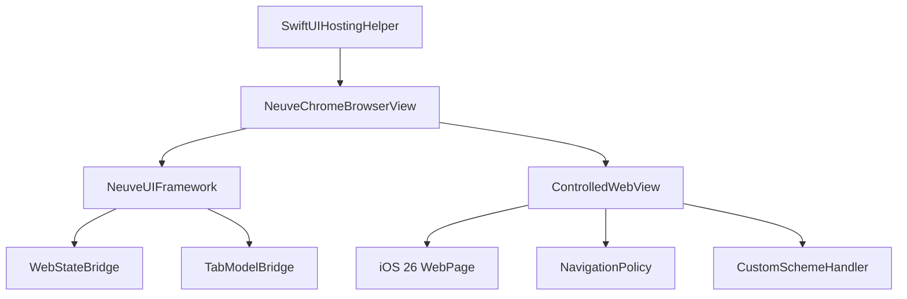
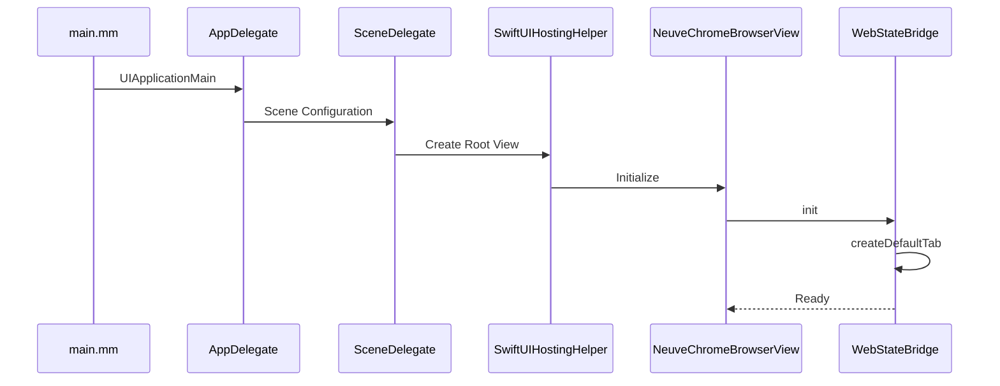
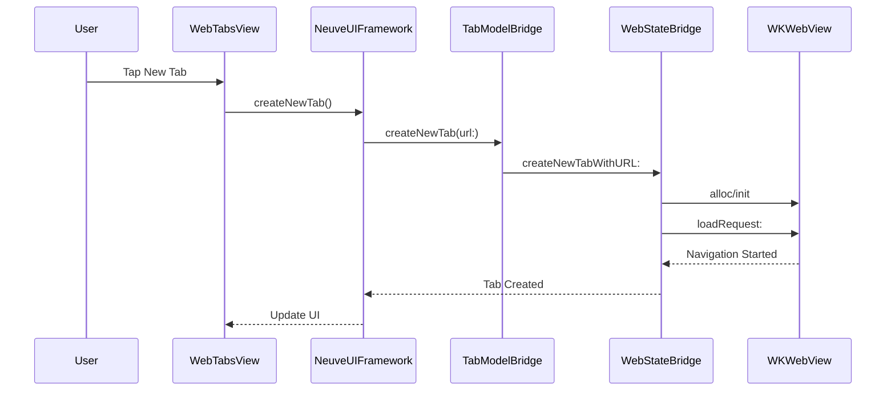
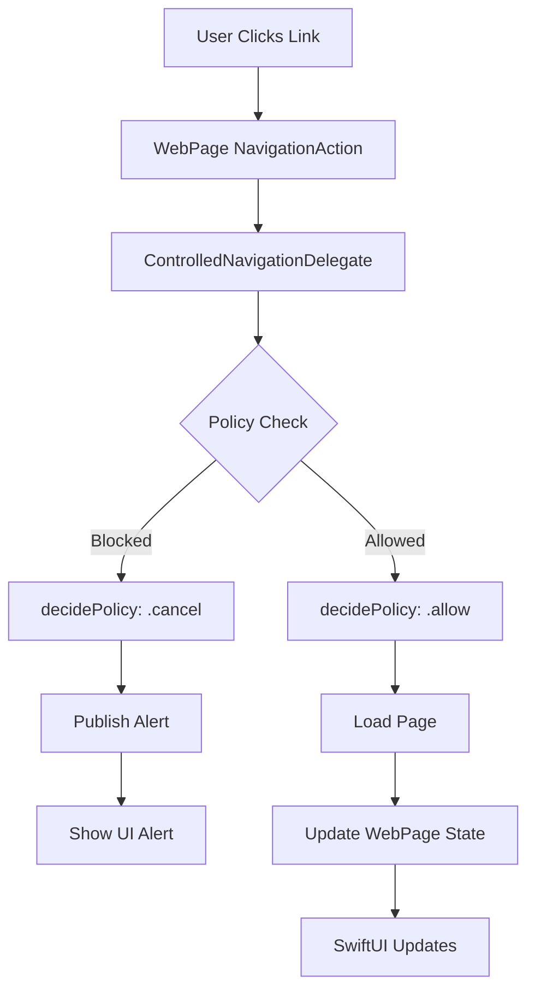
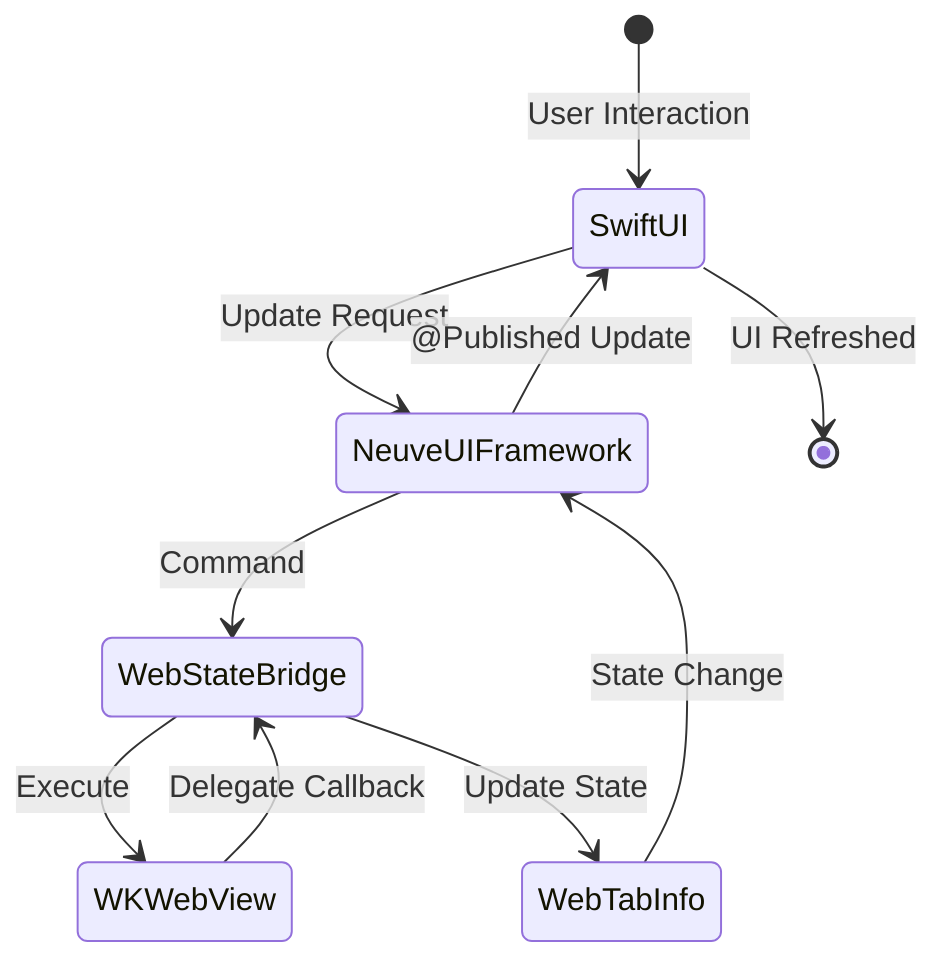
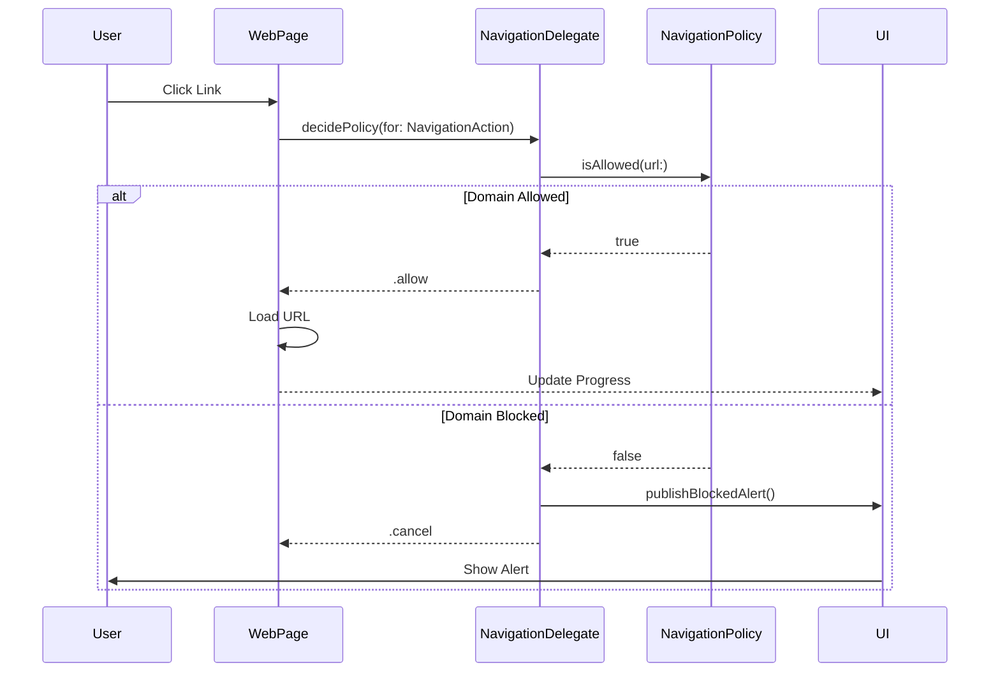

# Neuve Chrome Architecture Documentation

## Executive Summary

Neuve Chrome is an innovative iOS browser project built on top of the Chromium monorepo infrastructure, leveraging cutting-edge iOS 26 WebKit for SwiftUI APIs. This document provides a comprehensive analysis of the project's architecture, its integration with the Chromium ecosystem, and its unique approach to modern iOS browser development.

## Project Overview

### Core Concept
Neuve Chrome represents a **hybrid architecture** that combines:
- **Native iOS 26 WebKit for SwiftUI APIs** for web rendering and navigation
- **Chromium infrastructure** for build system, testing, and code organization
- **SwiftUI-first UI development** for modern iOS user experience
- **Bridge pattern implementations** for connecting Swift UI to existing Chromium services

### Key Innovation
The project pioneers the use of iOS 26's native WebKit SwiftUI integration (`WebView`, `WebPage`, `NavigationDeciding`) while maintaining compatibility with Chromium's broader ecosystem through strategic bridging layers.

## Architecture Layers

### 1. Build System Integration

#### GN Build Configuration
The project uses Chromium's GN (Generate Ninja) build system with custom iOS targeting:

```
ios/neuve_chrome/
├── BUILD.gn                    # Main build configuration
├── ios_deployment_target.gni    # iOS 26 deployment target
└── Info.plist                  # App metadata
```

**Key Build Components:**
- `ios_app_bundle` template for iOS app generation
- Separate source sets for Objective-C++ (`neuve_chrome_objc`) and Swift (`neuve_chrome_swift`)
- Custom deployment target: `neuve_chrome_ios_deployment_target = "26.0"`
- Framework dependencies: UIKit, SwiftUI, WebKit, Foundation

### 2. Language Bridge Architecture

#### Objective-C++ Bridge Layer
```
ios/neuve_chrome/
├── main.mm                           # App entry point
├── app/app_delegate.mm              # UIKit app lifecycle
├── services/WebStateBridge.mm       # WebKit bridging
└── NeuveChrome-Bridging-Header.h    # Swift-ObjC bridge
```

The `WebStateBridge` provides a crucial abstraction layer:
- Manages multiple `WKWebView` instances (legacy approach)
- Provides tab management capabilities
- Acts as navigation delegate for web views
- Exposes Objective-C interface to Swift components

#### Swift UI Layer
```
ios/neuve_chrome/
├── app/
│   ├── SwiftUIHostingHelper.swift   # SwiftUI root setup
│   └── browser/
│       ├── ControlledWebView.swift   # iOS 26 WebView wrapper
│       ├── NavigationPolicy.swift    # Domain control
│       └── CustomSchemeHandler.swift # URL scheme handling
├── ui/
│   ├── framework/
│   │   └── NeuveUIFramework.swift   # Main UI coordinator
│   └── views/
│       ├── WebTabsView.swift        # Browser tabs
│       ├── MemoriesView.swift       # Memory management
│       └── SearchView.swift         # Search interface
└── services/
    └── TabModelBridge.swift         # Tab management bridge
```

### 3. iOS 26 WebKit Integration

#### Native WebKit for SwiftUI Stack
The project leverages iOS 26's revolutionary WebKit APIs:

1. **WebView & WebPage**
   - Direct SwiftUI integration without UIViewRepresentable
   - Native `@Observable` conformance for reactive updates
   - Automatic state synchronization with SwiftUI

2. **NavigationDeciding Protocol**
   - Modern async/await navigation decisions
   - Policy-based URL filtering
   - Real-time security enforcement

3. **URLSchemeHandler**
   - AsyncSequence-based custom scheme handling
   - Support for `neuvebrowser://` URLs
   - Rich content serving capabilities

4. **Device Sensor Authorization**
   - Granular permission control
   - Motion sensors, camera, microphone access
   - Privacy-first defaults

### 4. Chromium Service Integration

#### Reused Chromium Components
While Neuve Chrome uses native iOS rendering, it integrates with Chromium infrastructure:

1. **Build System**
   - GN build files and templates
   - iOS-specific build rules from `//build/config/ios/`
   - Chromium's dependency management

2. **Base Libraries**
   - `//base` for cross-platform utilities
   - Logging, threading, and memory management
   - Platform abstractions

3. **Potential Service Integration Points**
   ```
   ios/chrome/browser/
   ├── tabs/          # Tab model and management
   ├── bookmarks/     # Bookmark services
   ├── history/       # History tracking
   ├── sync/          # Chrome sync integration
   └── prefs/         # Preferences/settings
   ```

### 5. UI Architecture

#### Tab-Based Navigation Structure
```
NeuveChromeBrowserView (Root)
├── HomeView          # Start page with recents
├── WebTabsView       # Browser with ControlledWebView
├── MemoriesView      # Advanced memory system
└── SearchView        # Voice/text search
```

#### Component Relationships


## Deep Dive: Bridge Architecture

### WebStateBridge - The Core Translation Layer

The `WebStateBridge` serves as the primary interface between Swift UI components and WebKit functionality:

#### Purpose and Design
1. **Tab Management Abstraction**
   - Maintains array of `WKWebView` instances
   - Tracks active tab index
   - Provides tab info through `WebTabInfo` objects

2. **Navigation Delegation**
   - Implements `WKNavigationDelegate`
   - Updates tab state on navigation events
   - Manages loading states and history

3. **Swift Compatibility**
   - Exposes Objective-C interface consumable by Swift
   - Returns UIView references for SwiftUI integration
   - Provides synchronous API for UI updates

#### Data Flow
```
Swift UI Layer
     ↓
TabModelBridge (Swift)
     ↓
WebStateBridge (Obj-C++)
     ↓
WKWebView (WebKit)
```

#### Key Methods and Their Purposes
- `createNewTabWithURL:` - Instantiates WKWebView and loads URL
- `getWebViewForTabAtIndex:` - Returns UIView for SwiftUI embedding
- `getAllTabs` - Provides tab metadata for UI rendering
- Navigation methods - Wrap WKWebView navigation APIs

#### Code Example: WebStateBridge Implementation

```objc
/**
 * WebStateBridge.h - Bridge interface between Swift UI and WebKit
 * 
 * This bridge provides tab management functionality by wrapping
 * WKWebView instances and exposing them through a Swift-compatible
 * Objective-C interface. It manages the lifecycle of web views
 * and maintains tab state information.
 */

// Tab information container - exposed to Swift as a simple data object
@interface WebTabInfo : NSObject
@property(nonatomic, strong) NSString* title;
@property(nonatomic, strong) NSURL* url;
@property(nonatomic, assign) BOOL isLoading;
@property(nonatomic, assign) BOOL canGoBack;
@property(nonatomic, assign) BOOL canGoForward;
@end

// Main bridge implementation
@implementation WebStateBridge

/**
 * Creates a new tab with the specified URL
 * This method:
 * 1. Creates a new WKWebView instance
 * 2. Sets up navigation delegation
 * 3. Creates corresponding WebTabInfo
 * 4. Switches to the new tab
 * 5. Initiates URL loading
 */
- (void)createNewTabWithURL:(NSURL*)url {
  // Create new web view with default configuration
  WKWebView* webView = [[WKWebView alloc] init];
  webView.navigationDelegate = self;  // Set self as navigation delegate
  [_webViews addObject:webView];
  
  // Create tab info to track state
  WebTabInfo* tabInfo = [[WebTabInfo alloc] init];
  tabInfo.title = @"Loading...";
  tabInfo.url = url;
  tabInfo.isLoading = YES;
  tabInfo.canGoBack = NO;
  tabInfo.canGoForward = NO;
  [_tabInfos addObject:tabInfo];
  
  // Switch to new tab and load URL
  _activeIndex = _tabInfos.count - 1;
  [webView loadRequest:[NSURLRequest requestWithURL:url]];
}

/**
 * WKNavigationDelegate callback - called when page finishes loading
 * This updates the tab info with the actual page title and URL,
 * and updates navigation capabilities (back/forward)
 */
- (void)webView:(WKWebView *)webView didFinishNavigation:(WKNavigation *)navigation {
  NSInteger index = [_webViews indexOfObject:webView];
  if (index != NSNotFound && index < (NSInteger)_tabInfos.count) {
    WebTabInfo* tabInfo = _tabInfos[index];
    tabInfo.isLoading = NO;
    tabInfo.url = webView.URL ?: tabInfo.url;
    tabInfo.title = webView.title.length > 0 ? webView.title : tabInfo.url.absoluteString;
    tabInfo.canGoBack = webView.canGoBack;
    tabInfo.canGoForward = webView.canGoForward;
  }
}
@end
```

### TabModelBridge - Swift Protocol Definition

The `TabModelBridge` protocol defines the Swift interface:

```swift
/**
 * TabModelBridge.swift - Swift protocol for tab management
 * 
 * This protocol defines the Swift-side interface for tab operations.
 * The actual implementation (TabModelBridgeImpl) is in Objective-C++
 * and wraps the WebStateBridge functionality.
 */

@objc protocol TabModelBridge {
    func createNewTab(url: URL)
    func closeTab(at index: Int)
    func switchToTab(at index: Int)
    var tabCount: Int { get }
}

/**
 * TabModelBridgeImpl.swift - Swift-to-ObjC bridge implementation
 * 
 * This class implements the TabModelBridge protocol by forwarding
 * calls to the underlying WebStateBridge. It handles type conversions
 * between Swift and Objective-C.
 */
class TabModelBridgeImpl: NSObject, TabModelBridge {
    private let webStateBridge: WebStateBridge
    
    init(webStateBridge: WebStateBridge) {
        self.webStateBridge = webStateBridge
        super.init()
    }
    
    func createNewTab(url: URL) {
        // Forward to Objective-C implementation
        webStateBridge.createNewTab(withURL: url)
    }
    
    func closeTab(at index: Int) {
        webStateBridge.closeTab(at: index)
    }
    
    func switchToTab(at index: Int) {
        webStateBridge.switchToTab(at: index)
    }
    
    var tabCount: Int {
        return webStateBridge.getTabCount()
    }
}
```

This creates a clean Swift API that hides the Objective-C implementation details.

### NeuveUIFramework - Central Coordination

The `NeuveUIFramework` acts as the main coordinator:

1. **Service Management**
   - Holds references to all bridge instances
   - Manages service lifecycle
   - Coordinates between different subsystems

2. **State Management**
   - `@Published` properties for UI binding
   - Central source of truth for app state
   - Handles state synchronization

3. **Business Logic**
   - Tab creation/deletion logic
   - Navigation policy enforcement
   - Memory management coordination

#### Code Example: NeuveUIFramework Implementation

```swift
/**
 * NeuveUIFramework.swift - Central UI coordination layer
 * 
 * This ObservableObject serves as the main coordinator for the entire
 * application. It manages the lifecycle of services, maintains app state,
 * and provides the business logic layer between UI and backend services.
 */

import SwiftUI
import Combine

@MainActor
class NeuveUIFramework: ObservableObject {
    // MARK: - Service Dependencies
    
    /**
     * Bridge to WebStateBridge for tab management
     * This is initialized during app startup and provides
     * the connection to the Objective-C++ layer
     */
    private let tabModelBridge: TabModelBridge
    
    /**
     * WebStateBridge instance for direct WebView access
     * Used when we need to get UIView references for SwiftUI
     */
    private let webStateBridge: WebStateBridge
    
    // MARK: - Published State
    
    /**
     * Currently selected tab in the tab bar
     * Changes to this trigger UI updates throughout the app
     */
    @Published var selectedTab: TabType = .home
    
    /**
     * Array of all open web tabs
     * Each WebTab contains metadata about a browser tab
     */
    @Published var webTabs: [WebTab] = []
    
    /**
     * Index of the currently active web tab
     * Used to highlight the active tab in the UI
     */
    @Published var activeTabIndex: Int = 0
    
    // MARK: - Initialization
    
    init() {
        // Create the WebStateBridge (Objective-C++)
        self.webStateBridge = WebStateBridge()
        
        // Create Swift wrapper around the bridge
        self.tabModelBridge = TabModelBridgeImpl(webStateBridge: webStateBridge)
        
        // Load initial tab state
        refreshTabState()
    }
    
    // MARK: - Tab Management
    
    /**
     * Creates a new browser tab with the specified URL
     * This method coordinates between the UI request and the bridge layer
     */
    func createNewTab(url: URL? = nil) {
        let targetURL = url ?? URL(string: "neuvebrowser://home")!
        
        // Create tab through bridge
        tabModelBridge.createNewTab(url: targetURL)
        
        // Refresh our local state
        refreshTabState()
        
        // Switch to tabs view to show the new tab
        selectedTab = .tabs
    }
    
    /**
     * Refreshes the local tab state from the bridge
     * This syncs the Swift UI state with the Objective-C++ layer
     */
    private func refreshTabState() {
        let allTabs = webStateBridge.getAllTabs() as? [WebTabInfo] ?? []
        
        // Convert Objective-C objects to Swift structs
        webTabs = allTabs.enumerated().map { index, tabInfo in
            WebTab(
                id: UUID(),
                title: tabInfo.title ?? "New Tab",
                url: tabInfo.url,
                favicon: nil,
                isLoading: tabInfo.isLoading,
                canGoBack: tabInfo.canGoBack,
                canGoForward: tabInfo.canGoForward
            )
        }
        
        activeTabIndex = webStateBridge.getActiveTabIndex()
    }
    
    /**
     * Returns the web view for embedding in SwiftUI
     * This is used by WebTabContentView to display web content
     */
    func getWebView(for index: Int) -> UIView {
        return webStateBridge.getWebView(forTabAtIndex: index)
    }
}
```

## Chromium Component Reuse Analysis

### Base Library (`//base`)

Neuve Chrome leverages Chromium's base library for:

1. **Memory Management**
   - PartitionAlloc for efficient memory allocation
   - RefCounted base classes for object lifecycle
   - Scoped pointer utilities

2. **Threading Infrastructure**
   - TaskRunner abstractions
   - Thread pools and message loops
   - Cross-platform synchronization primitives

3. **Logging and Debugging**
   - Chromium's logging macros (LOG, DLOG, etc.)
   - Crash reporting infrastructure
   - Performance tracing tools

4. **Platform Abstractions**
   - File path handling
   - Time utilities
   - String manipulation (base::string16, etc.)

### Build System (`//build`)

The project inherits:

1. **iOS Build Rules**
   - `ios_app_bundle` template
   - Code signing configuration
   - Entitlements handling

2. **Compilation Flags**
   - Optimization settings
   - Architecture targeting
   - SDK version management

3. **Dependency Management**
   - GN target dependencies
   - Framework linking
   - Resource bundling

### Potential Chrome Service Integration

While not currently implemented, the architecture supports:

1. **Tab Services (`//ios/chrome/browser/tabs/`)**
   - TabModel for advanced tab management
   - Tab restoration and session management
   - Tab sync capabilities

2. **Bookmark Services (`//ios/chrome/browser/bookmarks/`)**
   - BookmarkModel for bookmark storage
   - Sync integration
   - Import/export functionality

3. **History Services (`//ios/chrome/browser/history/`)**
   - HistoryService for browsing history
   - Search and filtering
   - Privacy controls

## Detailed Flow Diagrams

### Application Startup Flow



### iOS 26 WebKit Integration Flow

```mermaid
flowchart TD
    subgraph "SwiftUI Layer"
        A[ControlledWebView] --> B[@StateObject WebPage]
        A --> C[WebView Component]
    end
    
    subgraph "iOS 26 WebKit"
        D[WebPage Configuration] --> E[NavigationPreferences]
        D --> F[DeviceSensorAuthorization]
        D --> G[URLSchemeHandlers]
        
        H[NavigationDeciding] --> I[Async Policy Decision]
        J[WebPage Observable] --> K[State Changes]
    end
    
    subgraph "Navigation Flow"
        L[User Action] --> M[NavigationAction]
        M --> N[NavigationDeciding.decidePolicy]
        N --> O{Policy Check}
        O -->|Allow| P[Load Page]
        O -->|Cancel| Q[Show Alert]
    end
    
    C --> J
    B --> D
    I --> H
    K --> A
    M --> H
```

### Tab Creation Flow



### Navigation Decision Flow (iOS 26)



### Bridge Communication Layers

```mermaid
graph TB
    subgraph "Swift UI Layer"
        A[WebTabsView]
        B[ControlledWebView]
        C[NavigationToolbar]
    end
    
    subgraph "Swift Service Layer"
        D[NeuveUIFramework]
        E[TabModelBridge Protocol]
        F[NavigationPolicy]
    end
    
    subgraph "Obj-C++ Bridge Layer"
        G[WebStateBridge]
        H[TabModelBridgeImpl]
    end
    
    subgraph "WebKit Layer"
        I[WKWebView]
        J[WKNavigationDelegate]
        K[iOS 26 WebPage]
    end
    
    subgraph "Chromium Base"
        L[//base utilities]
        M[Memory Management]
        N[Threading]
    end
    
    A --> D
    B --> F
    C --> D
    D --> E
    E --> H
    H --> G
    G --> I
    G --> J
    B --> K
    G --> L
    H --> M
    D --> N
```

### State Synchronization Flow



### Build System Integration Flow

```mermaid
flowchart LR
    subgraph "GN Build Configuration"
        A[BUILD.gn] --> B[ios_app_bundle]
        A --> C[source_set neuve_chrome_objc]
        A --> D[source_set neuve_chrome_swift]
        
        E[ios_deployment_target.gni] --> F[iOS 26.0 Target]
    end
    
    subgraph "Chromium Infrastructure"
        G[//build/config/ios/rules.gni] --> B
        H[//base dependencies] --> C
        H --> D
        I[//build/apple/] --> J[Code Signing]
    end
    
    subgraph "Output"
        B --> K[Neuve Chrome.app]
        C --> K
        D --> K
        J --> K
    end
    
    style F fill:#f9f,stroke:#333,stroke-width:4px
```

### Navigation Policy Enforcement Flow



## Layer Communication Patterns

### 1. Swift to Objective-C++ Communication

**Pattern**: Protocol-based abstraction
```swift
// Swift defines protocol
@objc protocol TabModelBridge { }

// Obj-C++ implements
@implementation TabModelBridgeImpl
```

**Benefits**:
- Type safety in Swift
- Clean API boundaries
- Testability through mocking

### 2. Objective-C++ to WebKit Communication

**Pattern**: Delegate callbacks
```objc
// WebStateBridge acts as WKNavigationDelegate
- (void)webView:(WKWebView *)webView 
    didFinishNavigation:(WKNavigation *)navigation
```

**Benefits**:
- Asynchronous event handling
- State synchronization
- Error management

### 3. iOS 26 WebKit to SwiftUI Communication

**Pattern**: Observable state binding

```swift
/**
 * ControlledWebView.swift - iOS 26 WebKit integration example
 * 
 * This demonstrates how iOS 26's WebPage observable properties
 * automatically trigger SwiftUI updates without manual binding
 */

@available(iOS 26.0, *)
struct ControlledWebView: View {
    @StateObject private var page: WebPage
    @State private var loadingProgress: Double = 0.0
    @State private var isLoading: Bool = false
    @State private var canGoBack: Bool = false
    @State private var canGoForward: Bool = false
    
    var body: some View {
        VStack {
            // Progress bar automatically updates as page loads
            if isLoading {
                ProgressView(value: loadingProgress)
                    .progressViewStyle(.linear)
            }
            
            // WebView with automatic state synchronization
            WebView(page)
                .onChange(of: page.estimatedProgress) { progress in
                    // Automatically called when progress changes
                    loadingProgress = progress
                }
                .onChange(of: page.isLoading) { loading in
                    // Automatically called when loading state changes
                    isLoading = loading
                }
                .onChange(of: page.backForwardList) { list in
                    // Automatically updates navigation button states
                    canGoBack = !list.backList.isEmpty
                    canGoForward = !list.forwardList.isEmpty
                }
                .onAppear {
                    // Initial page load
                    Task {
                        await page.load(URLRequest(url: initialURL))
                    }
                }
        }
    }
}
```

**Benefits**:
- Automatic UI updates via @Observable
- Reactive programming model
- Reduced boilerplate
- Type-safe state management

### 4. Chromium Base Integration

**Pattern**: Selective importing

```objc
/**
 * Example of how Neuve Chrome could leverage Chromium base utilities
 * Currently minimal usage, but shows integration patterns
 */

// In WebStateBridge.mm or other Objective-C++ files
#import "base/logging.h"
#import "base/memory/ref_counted.h"
#import "base/threading/thread_task_runner_handle.h"
#import "base/strings/sys_string_conversions.h"

@implementation WebStateBridge

- (void)logNavigationEvent:(NSURL*)url {
    // Using Chromium's logging infrastructure
    LOG(INFO) << "Navigating to: " << base::SysNSStringToUTF8([url absoluteString]);
    
    // Could also use DLOG for debug-only logging
    DLOG(INFO) << "Tab count: " << [self getTabCount];
}

- (void)performAsyncOperation {
    // Using Chromium's threading utilities
    base::ThreadTaskRunnerHandle::Get()->PostDelayedTask(
        FROM_HERE,
        base::BindOnce(&WebStateBridge::DelayedOperation, base::Unretained(self)),
        base::Seconds(1)
    );
}

@end
```

**Benefits**:
- Minimal dependencies
- Platform consistency
- Proven utilities
- Performance optimizations

## Architecture Evolution Path

### Current State
- Basic tab management through WebStateBridge
- iOS 26 WebKit for rendering
- Minimal Chromium service integration

### Near-term Opportunities
1. Replace WebStateBridge with direct iOS 26 WebPage management
2. Integrate Chrome bookmark services
3. Add history tracking with Chrome's HistoryService

### Long-term Vision
1. Full Chrome service integration (sync, passwords, etc.)
2. Extension framework support
3. Multi-platform code sharing (macOS, visionOS)

## Conclusion

Neuve Chrome's architecture demonstrates a sophisticated approach to modernizing browser development:

1. **Strategic Bridging**: Careful use of bridge patterns to connect modern Swift UI with existing infrastructure
2. **Progressive Enhancement**: iOS 26 APIs used where available with fallback options
3. **Minimal Dependencies**: Selective use of Chromium components maintains flexibility
4. **Clear Layer Separation**: Well-defined boundaries between UI, business logic, and platform code

The architecture provides a solid foundation for both immediate functionality and future expansion while maintaining the benefits of the Chromium ecosystem.